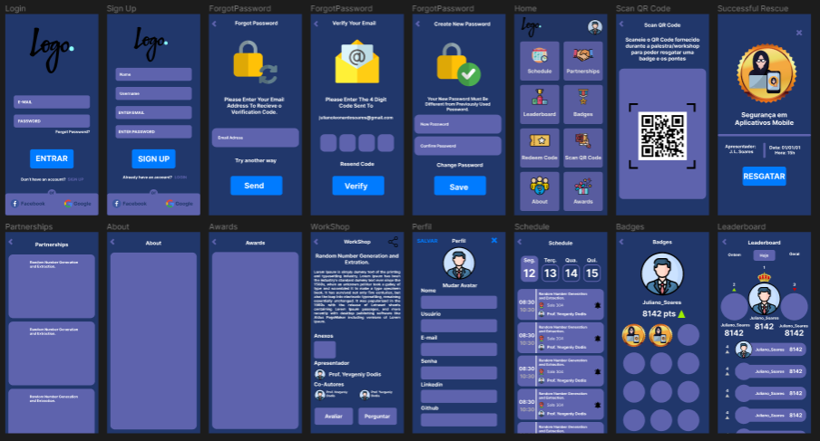

# Backend Para Aplicativo de Gamificação de Eventos

> Este projeto tem como objetivo transformar os eventos em games, incentivando as pessoas a se tornarem mais participativas durante o evento com incentivo de pontuações e recompensas por ações que elas fazem. Este projeto terá dois aplicativos, um para os usuários verem suas pontuações e poderem escanear QR Codes durante o evento que lhes darão pontuações caso elas terminem o desafio proposto no QR Code, também poderão fazer perguntas durante as palestras, compartilhar, ser notificado caso um evento ira começar, avaliar as palestras assistidas, escanear QR Codes de outros usuários e poder visualizar suas redes sociais e assim poder se conectar com elas. O outro será um aplicativo gerenciador para as pessoas do grupo de organização do evento para fazer o check-in, e atribuir pontos aos usuários caso necessário, também visualizar a lista de presença e o ranking da gamificação, e sortear prêmios para as pessoas presentes em uma palestra.  

### Ajustes e melhorias

O projeto ainda está em desenvolvimento e as próximas atualizações serão voltadas nas seguintes tarefas:

- [x] CRUD de usuários na aplicação.
- [x] Ao inserir um usuário gerar automaticamente um QR Code para ele.
- [ ] CRUD de palestras/workshops/eventos
- [ ] Atribuição de pontuação
- [ ] Ranking

## 💻 Pré-requisitos

Antes de começar, verifique se você atendeu aos seguintes requisitos:
* C#
* .Net Core
* Azure
* SQL Server

## 📫 Contribuindo
<!---Se o seu README for longo ou se você tiver algum processo ou etapas específicas que deseja que os contribuidores sigam, considere a criação de um arquivo CONTRIBUTING.md separado--->
Para contribuir, siga estas etapas:

1. Bifurque este repositório.
2. Crie um branch: `git checkout -b <nome_branch>`.
3. Faça suas alterações e confirme-as: `git commit -m '<mensagem_commit>'`
4. Envie para o branch original: `git push origin <nome_do_projeto> / <local>`
5. Crie a solicitação de pull.

Como alternativa, consulte a documentação do GitHub em [como criar uma solicitação pull](https://help.github.com/en/github/collaborating-with-issues-and-pull-requests/creating-a-pull-request).

## 🤝 Colaboradores

Agradecemos às seguintes pessoas que contribuíram para este projeto:

<table>
  <tr>
    <td align="center">
      <a href="#">
         
        
          <b>Juliano Leonardo Soares</b>
        
      </a>
    </td>
  </tr>
</table>
